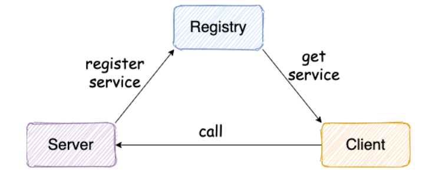
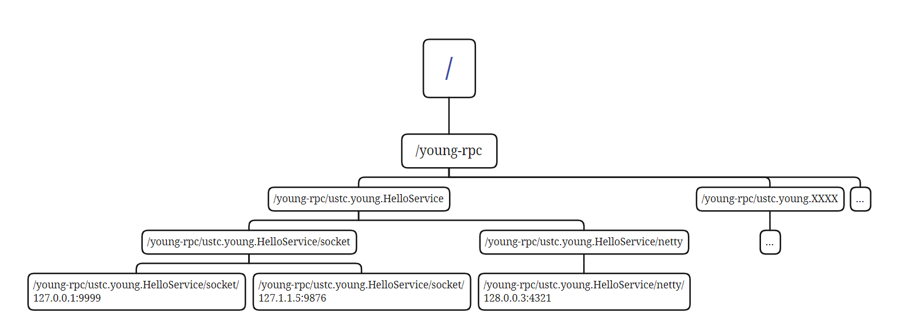
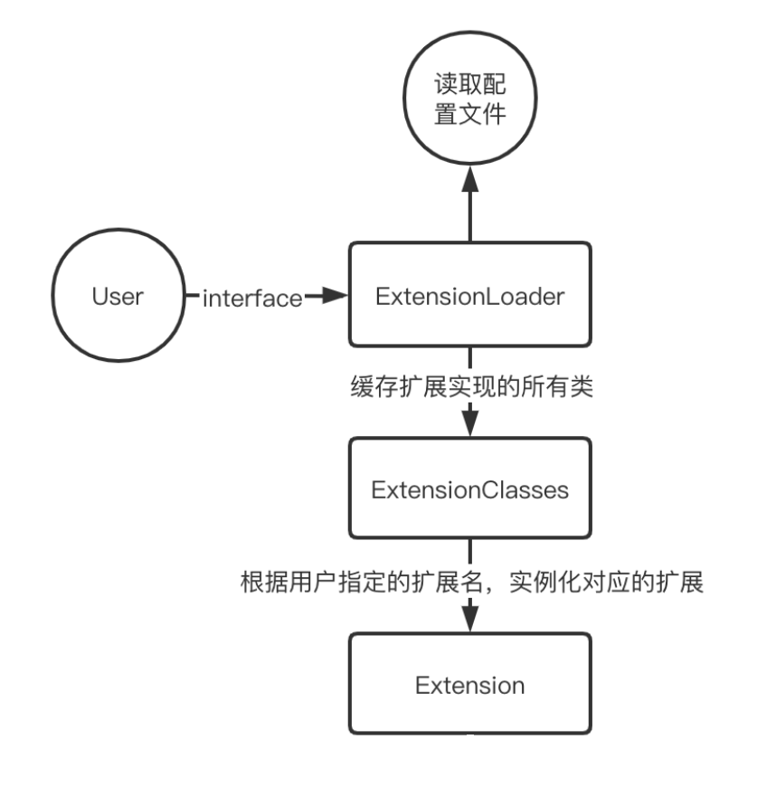
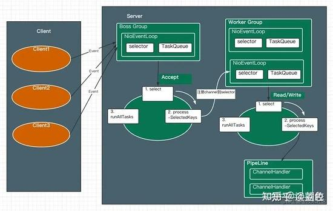
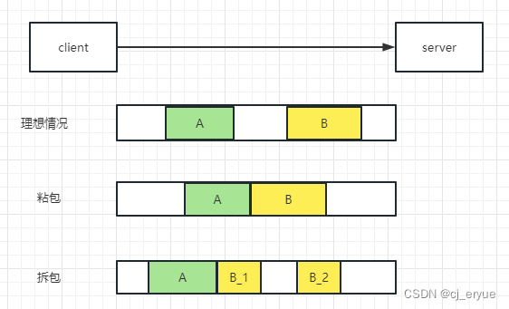
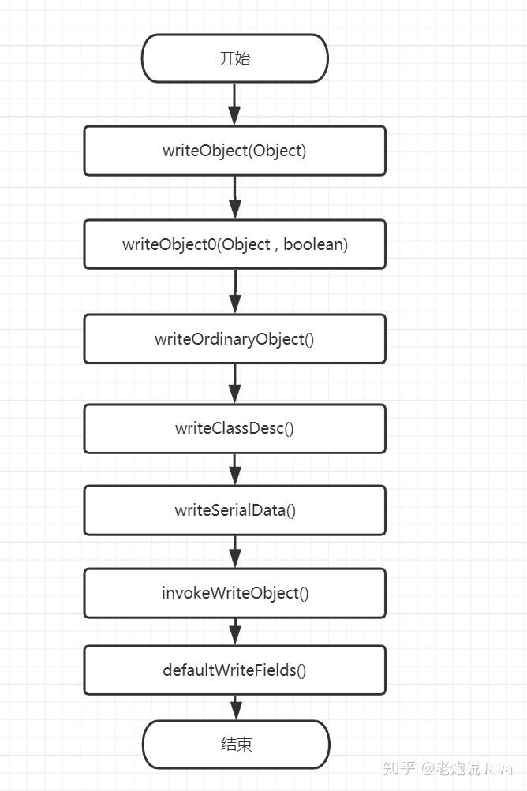

学习Guide佬的[guide-rpc-framework](https://github.com/Snailclimb/guide-rpc-framework/tree/master)项目，完成的一个RPC框架

# 学习计划：
- [x] 服务注册与发现
- [x] 负载均衡
- [x] 远程连接及调用
    - [x] socket
    - [x] netty
        - [x] 简易编码协议
        - [x] 自定义编码协议
        - [x] CompletableFuture实现非阻塞发送消息
    - [x] 序列化
- [x] 动态代理
- [x] 注解扫描实现服务的自动注册与注入（spring-context）

可扩展部分
- [ ] 监控模块（借鉴 Dubbo 的监控模块的设计）
- [ ] 压缩
- [ ] 手动实现注解扫描

# 学习笔记：
## RPC框架
### 是什么
可以帮助我们调用远程机器上的方法就像调用本地机器的方法一样简单，而不用去考虑底层的远程网络传输的细节
### 原理
客户端（调用方）会通过一个代理类调用每个接口的方法，而此代理类通过网络传输到服务端并将服务端返回的调用结果作为其调用结果，从而让客户端以为是在本地进行的调用。

### 实现过程



1. 首先需要有一个**注册中心**，这样服务端向注册中心进行注册，注册中心会记录服务端提供的服务信息，之后客户端需要服务时，也要先向注册中心查找提供服务的服务器地址。
2. 之后就需要进行**网络传输**，因为客户端与服务提供者的服务器是在不同机器上的，为了实现客户端能调用服务端的服务，我们就要实现底层的网络传输，通过发送调用请求和响应实现远程服务的调用，而网络传输都是二进制的字节码，因此我们也需要实现序列化和反序列化将请求消息对象和响应消息对象进行二进制的编解码，同时为了解决Tcp粘包拆包问题以及序列化方式的可扩展问题，我们还需要定义自己的传输协议，这样在每段消息头中加入消息长度字段和序列化协议字段信息，就可以有效的分割出每个消息，并进行反序列化。
3. 完成上面两步，我们基本上以及实现了RPC的雏形，也就是实现了客户端调用服务端的方法，但这样意味着每次客户端要调用一个服务，需要先组装调用请求消息，然后调用发送消息的方法，最后获取到响应消息，对客户端来说调用一个服务依然比较复杂，涉及到了很多底层的传输协议。因此我们就需要实现一个**动态代理**，当客户端要调用一个服务时就通过动态代理来调用，而动态代理就会根据客户端调用的方法、参数等信息构造一个调用请求，再通过注册中心找到提供服务的地址，并进行通信获取调用结果，最后将调用结果返回给客户端，这样对于客户端而言就真的感觉只是通过代理类调用了一个方法而已，屏蔽掉了所有的远程传输过程。
4. 很多情况下为了提高系统的可用性，同一个服务可能由多个服务端提供，因此为了使客户端的调用请求均匀的分配给各个提供服务的机器，防止一个机器响应过多请求导致宕机、崩溃等问题，我们就需要在客户端向注册中心查找服务的返回服务地址时，加入一个**负载均衡**的算法，如果有多个请求，每次就均衡的返回一个服务地址给客户端，而不是总是返回同一个服务地址。
5. 最后为了进一步屏蔽服务注册和发现的细节，我们可以借助spring-context的包扫描的功能，通过定义服务的注解和引用服务的注解，实现服务端启动时可以自动扫描包下的所有添加了定义服务注解的类，在该类初始化前先**自动向注册中心注册服务**。同时客户端启动时，对于需要的接口添加引用服务的注解，这样在自动扫描包时发现bean的该属性就进行**自动装配代理类**实现初始化，调用时就会调用代理类的invoke方法，实现远程调用。

## 注册中心

注册中心相当于是一个目录服务，主要是负责记录服务端启动时发送的注册服务信息，然后客户端需要服务时先从注册中心查找服务，注册中心会返回一个可用的服务地址。
所以注册中心最核心的两个功能是**注册服务**和**查找服务**。
而我们可以使用Zookeeper作为作为注册中心，Zookeeper为我们提供了一个高可用、高性能、稳定的分布式数据一致性解决方案，而且其数据是保存在内存中的，在读多余写的场景下性能非常棒，而我们注册中心显然就是一个读多于写的场景，因此使用Zookeeper是一个比较好的选择。
### 服务注册

定义接口：
```java
public interface ServiceRegistry {  
	/**  
	* 注册服务  
	* @param rpcServiceName 服务名  
	* @param inetSocketAddress 地址  
	* @param transportService 传输服务工具 socke/netty  
	*/  
	void registerService(String rpcServiceName, InetSocketAddress inetSocketAddress,String transportService);  
}
```
使用Zookeeper的接口实现：
```java
public class ZkServiceRegistryImpl implements ServiceRegistry {  
	@Override  
	public void registerService(String rpcServiceName, InetSocketAddress inetSocketAddress,String transportService) {  
		String servicePath = CuratorUtils.ZK_REGISTER_ROOT_PATH + "/" + rpcServiceName+"/" +transportService + inetSocketAddress.toString();  
		CuratorFramework zkClient = CuratorUtils.getZkClient();  
		CuratorUtils.createPersistentNode(zkClient,servicePath);  
	}  
}
```
> 为了兼容各种传输层的工具，我们可以注册是提供服务端使用的传输层工具，这样客户端查找时也可以根据自身支持的传输工具实现服务的调用，提高了系统的兼容性。

这样对于一个服务端提供的基于socket的传输方式的服务ustc.young.HelloService，其服务器ip是127.0.0.1，端口是9999，我们就会在Zookeeper中创建/young-rpc/ustc.young.HelloService/socket/127.0.0.1:9999这样的节点。多个服务端可能会提供相同的服务，最终Zookeeper中的节点可能如下图所示：


代码中CuratorUtil是一个基于Zookeeper的Curator客户端实现的工具类：
```java
@Slf4j
public final class CuratorUtils {
    private static final int BASE_SLEEP_TIME = 1000;
    private static final int MAX_RETRIES = 3;
    public static final String ZK_REGISTER_ROOT_PATH = "/young-rpc";
    //携带传输服务的地址Map eg:HelloService->[socket/127.0.0.1:9999]
    private static final Map<String, List<String>> SERVICE_ADDRESS_MAP = new ConcurrentHashMap<>();
    //通过ConcurrentHashMap.newKeySet()创建一个线程安全的Set
    private static final Set<String> REGISTERED_PATH_SET = ConcurrentHashMap.newKeySet();
    private static CuratorFramework zkClient;
    private static final String DEFAULT_ZOOKEEPER_ADDRESS = "127.0.0.1:2181";
    private CuratorUtils(){
    }

    /**
     * 创建持久化节点
     * @param zkClient zookeeper客户端
     * @param path 路径，eg：/young-rpc/ustc.young.HelloService/socket/127.0.0.1:9999
     */
    public static void createPersistentNode(CuratorFramework zkClient,String path){
        try {
            if(REGISTERED_PATH_SET.contains(path)||zkClient.checkExists().forPath(path)!=null){
                log.info("节点已经存在，path:[{}]",path);
            }else {
                zkClient.create().creatingParentsIfNeeded().withMode(CreateMode.PERSISTENT).forPath(path);
                log.info("创建持久化节点成功，path:[{}]",path);
            }
            REGISTERED_PATH_SET.add(path);
        } catch (Exception e) {
            log.error("创建持久化节点失败，path:[{}]",path);
        }
    }
    

    /**
     * 获取子节点
     * @param zkClient 客户端
     * @param rpcServiceName 节点名称（服务名）
     * @param transportName 传输服务名称
     * @return
     */
    public static List<String> getChildrenNodes(CuratorFramework zkClient,String rpcServiceName,String transportName){
        if(SERVICE_ADDRESS_MAP.containsKey(rpcServiceName+"/"+transportName)){
            return SERVICE_ADDRESS_MAP.get(rpcServiceName+"/"+transportName);
        }
        List<String> result = null;
        String servicePath = getServicePath(rpcServiceName,transportName);
        try {
            result = zkClient.getChildren().forPath(servicePath);
            SERVICE_ADDRESS_MAP.put(rpcServiceName+"/"+transportName,result);
            registerWatcher(rpcServiceName,zkClient);
        } catch (Exception e) {
            log.error("获取子节点失败，path:[{}]",servicePath);
        }
        return result;
    }

    /**
     * 清空某个服务地址相关的所有节点
     * @param zkClient 客户端
     * @param inetSocketAddress 服务地址
     */
    public static void clearRegistry(CuratorFramework zkClient, InetSocketAddress inetSocketAddress){
        REGISTERED_PATH_SET.stream().parallel().forEach(p->{
            try{
                if(p.endsWith(inetSocketAddress.toString())){
                    log.info("清空注册机中的节点，path:[{}]",p);
                    zkClient.delete().forPath(p);
                }
            } catch (Exception e) {
                log.error("清空注册机中的节点失败，path:[{}]",p);
            }
        });
    }

    /**
     * 获取zookeeper客户端，已启动直接返回，未启动则从配置文件中查找是否存在连接地址，通过失败重试策略连接，并超时等待30秒
     * @return zookeeper客户端
     */
    public static CuratorFramework getZkClient(){
        //已启动则直接返回
        if(zkClient!=null&&zkClient.getState()== CuratorFrameworkState.STARTED){
            log.info("zk客户端已启动");
            return zkClient;
        }
        //否则通过重试策略启动
        //检测是否存在配置文件
        Properties properties = PropertiesFileUtil.readPropertiesFile(RpcConfigEnum.RPC_CONFIG_PATH.getPropertyValue());
        String zookeeperAddress = properties!=null && properties.getProperty(RpcConfigEnum.ZOOKEEPER_ADDRESS.getPropertyValue())!=null
                ? properties.getProperty(RpcConfigEnum.ZOOKEEPER_ADDRESS.getPropertyValue())
                : DEFAULT_ZOOKEEPER_ADDRESS;
        RetryPolicy retryPolicy = new ExponentialBackoffRetry(BASE_SLEEP_TIME,MAX_RETRIES);
        zkClient = CuratorFrameworkFactory.builder()
                .connectString(zookeeperAddress)
                .retryPolicy(retryPolicy)
                .build();
        zkClient.start();
        try {
            //连接上zookeeper 最多等待30秒
            if(!zkClient.blockUntilConnected(30, TimeUnit.SECONDS)){
                throw new RuntimeException("连接zookeeper超时。");
            }
        } catch (InterruptedException e) {
            log.error(e.getMessage());
        }
        return zkClient;
    }


    /**
     * 为节点注册一个监听器，如果发生变化就更新到SERVICE_ADDRESS_MAP中
     * @param rpcServiceName 节点服务名称
     * @param zkClient 客户端
     * @throws Exception
     */
    private static void registerWatcher(String rpcServiceName,CuratorFramework zkClient) throws Exception {
        String servicePath = getServicePath(rpcServiceName);
        PathChildrenCache pathChildrenCache = new PathChildrenCache(zkClient,servicePath,true);
        PathChildrenCacheListener pathChildrenCacheListener = ((curatorFramework, pathChildrenCacheEvent) -> {
            List<String> transportNodes = curatorFramework.getChildren().forPath(servicePath);
            for(String transport:transportNodes){
                List<String> serviceAddresses = curatorFramework.getChildren().forPath(servicePath+"/"+transport);
                SERVICE_ADDRESS_MAP.put(rpcServiceName+"/"+transport,serviceAddresses);
            }
        });
        pathChildrenCache.getListenable().addListener(pathChildrenCacheListener);
        pathChildrenCache.start();
    }

    private static String getServicePath(String rpcServiceName,String transportName){
        return ZK_REGISTER_ROOT_PATH + "/" + rpcServiceName + "/" + transportName;
    }

    private static String getServicePath(String rpcServiceName){
        return ZK_REGISTER_ROOT_PATH + "/" + rpcServiceName;
    }

    private static List<String> getNodesByTransport(List<String> nodes,String transportName){
        if(nodes==null){
            return null;
        }
        for (String s:nodes){
            log.info("node :{},transport:{}",s,transportName);
        }
        return nodes.stream().filter(node->node.startsWith(transportName)).collect(Collectors.toList());
    }

}
```
### 查找服务
定义接口：
```java
public interface ServiceDiscovery {
    /**
     * 通过服务名称获取服务
     * @param rpcRequest 服务请求数据对象
     * @param transport 传输服务提供者
     * @return 服务地址
     */
    InetSocketAddress lookupService(RpcRequest rpcRequest, String transport);
}
```
基于Zookeeper的实现：
```java
@Slf4j
public class ZkServiceDiscoveryImpl implements ServiceDiscovery {
    private final LoadBalance loadBalance;

    public ZkServiceDiscoveryImpl(){
        Properties properties = PropertiesFileUtil.getPropertiesFile(RpcConfigEnum.RPC_CONFIG_PATH.getPropertyValue());
        String loadBalanceName =  properties!=null && properties.getProperty(RpcConfigEnum.LOAD_BALANCE.getPropertyValue())!=null
                ? properties.getProperty(RpcConfigEnum.LOAD_BALANCE.getPropertyValue())
                : DefaultConfigEnum.DEFAULT_LOAD_BALANCE.getName();
        loadBalance = ExtensionLoader.getExtensionLoader(LoadBalance.class).getExtension(loadBalanceName);
    }
    @Override
    public InetSocketAddress lookupService(RpcRequest rpcRequest, String transport) {
        String rpcServiceName = rpcRequest.getRpcServiceName();
        CuratorFramework zkClient = CuratorUtils.getZkClient();
        List<String> serviceUrls = CuratorUtils.getChildrenNodes(zkClient,rpcServiceName, transport);
        if(CollectionUtil.isEmpty(serviceUrls)){
            throw new RuntimeException("没有找到可用的服务["+rpcServiceName+"]。");
        }
        for (String s:serviceUrls){
            log.info("serviceUrls:{}",s);
        }
        //负载均衡
        String targetUrl = loadBalance.selectServiceAddress(serviceUrls,rpcRequest);
        String[] socketAddressArray = targetUrl.split(":");
        String host = socketAddressArray[0];
        int port = Integer.parseInt(socketAddressArray[1]);
        return new InetSocketAddress(host,port);
    }
}
```
其中LoadBalance是负载均衡类的，在[[#负载均衡]]章节会介绍其实现。
其主要是通过rpc请求对象和客户端使用的传输工具进行查找，根据rpc请求我们可以获取其调用服务的类名称再结合传输工具，我们就可以去Zookeeper中查找节点，返回所有已经注册的提供服务的套接字（ip+port)，最后再根据负载均衡算法选择出一个服务地址。
### SPI机制

在查找服务的实现中，对于负载均衡属性的初始化时，我们用了
```java
Properties properties = PropertiesFileUtil.getPropertiesFile(RpcConfigEnum.RPC_CONFIG_PATH.getPropertyValue());  
String loadBalanceName = properties!=null && properties.getProperty(RpcConfigEnum.LOAD_BALANCE.getPropertyValue())!=null  
? properties.getProperty(RpcConfigEnum.LOAD_BALANCE.getPropertyValue())  
: DefaultConfigEnum.DEFAULT_LOAD_BALANCE.getName();  
loadBalance = ExtensionLoader.getExtensionLoader(LoadBalance.class).getExtension(loadBalanceName);
```
进行加载，这实际上是参考[Dubbo的SPI机制](https://cn.dubbo.apache.org/zh-cn/overview/mannual/java-sdk/reference-manual/spi/overview/)实现的加载扩展类方法，十分精妙，使模块之间解耦，符合开闭原则，对扩展开放，对修改关闭。同时还能通过缓存实例实现单例模式。

加载扩展的整个流程如下：


主要步骤为 4 个：

- 读取用户rpc配置文件获取用户配置的扩展名
- 读取并解析扩展类的配置文件
- 缓存所有扩展实现
- 基于用户配置的扩展名，实例化对应的扩展实现

ExtensionLoader源码分析：

SPI 加载固定扩展类的第一步是获取扩展类的加载器，即getExtensionLoader方法：
```java
/**
 * 获取加载器
 * @param type 扩展类
 * @return 类加载器
 */
public static <S> ExtensionLoader<S> getExtensionLoader(Class<S> type){
	if(type==null){
		throw new IllegalArgumentException("扩展类型不能为空。");
	}
	if(!type.isInterface()){
		throw new IllegalArgumentException("扩展类型必须是一个接口。");
	}
	if(type.getAnnotation(SPI.class)==null){
		throw new IllegalArgumentException("扩展类型必须添加@SPI注解。");
	}
	//单例模式，从缓存中获取，没有则创建
	ExtensionLoader<S> extensionLoader = (ExtensionLoader<S>) EXTENSION_LOADERS.get(type);
	if(extensionLoader==null){
		//保证只有一个线程能够创建类加载器
		EXTENSION_LOADERS.putIfAbsent(type,new ExtensionLoader<>(type));
		extensionLoader = (ExtensionLoader<S>) EXTENSION_LOADERS.get(type);
	}
	return extensionLoader;
}
```
获取完类加载器之后，就是通过加载器的 getExtension 方法获取实例：
```java
/**
 * 获取扩展类的实例
 * @param name
 * @return
 */
public T getExtension(String name){
	if(StringUtil.isBlank(name)){
		throw new IllegalArgumentException("扩展名称不能为null或空字符串。");
	}
	//实现延迟初始化，从缓存中获取实例的holder，没有则新建一个holder
	Holder<Object> holder = cachedInstances.get(name);
	if(holder==null){
		cachedInstances.putIfAbsent(name,new Holder<>());
		holder = cachedInstances.get(name);
	}
	//利用holder进行双重检查，实现单例模式
	Object instance = holder.get();
	if(instance==null){
		synchronized (holder){
			instance = holder.get();
			if(instance==null){
				instance = createExtension(name);
				holder.set(instance);
			}
		}
	}
	return (T) instance;
}
```

>对于每个实例用一个 #Holder对象 进行保持，这样不仅可以延迟初始化，更重要的是通过双重检查锁定Holder进行初始化，避免了多次实例化的开销和线程安全问题。

如果实例还没创建，就需要通过createExtension方法进行创建：
```java
/**
 * 单例模式创建扩展类的实例，从缓存中查找，有则返回无则新建
 * @param name 扩展类名称
 * @return 实例对象
 */
private T createExtension(String name){
	//从所有扩展的class集合中通过名称找到此扩展的class
	Class<?> clazz = getExtensionClasses().get(name);
	if(clazz==null){
		throw new RuntimeException("没有找到此扩展："+name);
	}
	T instance = (T) EXTENSION_INSTANCES.get(clazz);
	//双重检查
	if(instance==null){
		try{
			EXTENSION_INSTANCES.putIfAbsent(clazz,clazz.newInstance());
			instance = (T) EXTENSION_INSTANCES.get(clazz);
		} catch (Exception e) {
			log.error(e.getMessage());
		}
	}
	return (T)instance;
}
```
首先通过名称去获取到扩展类的Class对象，然后在缓存中查找该Class类是否存在实例化对象，没有的话就通过Class对象的newInstance方法调用无参构造函数进行实例化。

获取扩展类的Class对象集合需要使用getExtensionClasses方法：
```java
/**
 * 获取扩展类的class类Map，从缓存中查找，有则返回无则从文件中加载所有扩展类，实现延迟初始化
 * @return
 */
private Map<String,Class<?>> getExtensionClasses(){
	//从缓存中的Class对象集合持有类对象获取
	Map<String,Class<?>> classes = cachedClasses.get();
	//双重检查
	if (classes == null){
		synchronized (cachedClasses){
			classes = cachedClasses.get();
			if(classes == null){
				//不需要ConcurrentHashMap，原因是class类只需要在第一次初始化时写入(双重检查已经保证了单线程操作），之后只是需要并发读取
				classes = new HashMap<>();
				loadDirectory(classes);
				cachedClasses.set(classes);
			}
		}
	}
	return classes;
}
```
此方法的目的是首次加载从配置文件解析出拓展项名称到拓展类的映射关系表（Map<名称, 拓展类Class对象>），之后再根据拓展项名称从映射关系表中取出相应的拓展类即可。

首次加载需要通过loadDirectory方法从配置文件解析映射关系表：
```java
private void loadDirectory(Map<String,Class<?>> extensionClasses){
	String fileName = ExtensionLoader.SERVICE_DIRECTORY + type.getName();
	try {
		Enumeration<URL> urls;
		ClassLoader classLoader = ExtensionLoader.class.getClassLoader();
		urls = classLoader.getResources(fileName);
		if(urls!=null){
			while (urls.hasMoreElements()){
				URL resourceUrl = urls.nextElement();
				loadResource(extensionClasses,classLoader,resourceUrl);
			}
		}else {
			log.info("urls null!");
		}
	} catch (IOException e) {
		log.error(e.getMessage());
	}
}
```
loadDirectory 方法先通过 classLoader 获取所有资源链接，然后再通过 loadResource 方法加载资源：
```java
/**
 * 用于读取和解析某个url地址的配置文件，并通过反射加载类(classLoader.loadClass(clazzName))
 * @param extensionClasses 扩展类的class类Map
 * @param classLoader 类加载器，可以用于动态地根据配置文件中的类名加载对应的类
 * @param resourceUrl 类配置文件的url地址
 */
private void loadResource(Map<String,Class<?>> extensionClasses, ClassLoader classLoader, URL resourceUrl){
	try (BufferedReader reader = new BufferedReader(new InputStreamReader(resourceUrl.openStream(),UTF_8))){
		String line;
		//按行读取
		while ((line= reader.readLine())!=null){
			//获取每行注释的下标
			final int ci = line.indexOf('#');
			if(ci>=0){
				//忽略注释
				line = line.substring(0,ci);
			}
			line = line.trim();
			if(line.length()>0){
				try{
					//读取键值对形式的配置k=v
					final int ei = line.indexOf('=');
					String name = line.substring(0,ei).trim();
					String clazzName = line.substring(ei+1).trim();
					if(name.length()>0&&clazzName.length()>0){
						Class<?> clazz = classLoader.loadClass(clazzName);
						extensionClasses.put(name,clazz);
					}
				} catch (ClassNotFoundException e) {
					log.error(e.getMessage());
				}
			}
		}
	} catch (IOException e) {
		log.error(e.getMessage());
	}
}
```
这个方法主要就是通过资源的url地址读取配置文件，并进行解析，使用反射加载配置文件中类的Class对象，并形成名称与Class对象的映射存入缓存中。

**总结：**
使用SPI机制加载动态扩展类的具体流程就是先为每个扩展类创建单例的扩展加载器，之后用该扩展加载器进行类实例化对象的加载，而实例化对象是通过其扩展类的Class对象的newInstance方法调用无参构造函数进行构造的，因此我们需要先从配置文件中读取到该扩展类扩展名称和扩展类Class对象的映射关系，而为了避免重复加载浪费资源，最好的办法是第一次加载时将扩展类的名称和扩展类Class对象的映射关系缓存起来，后续只需要在缓存中查找映射关系即可。

例如加载负载均衡扩展类的时，我们时这样调用的：
```java
Properties properties = PropertiesFileUtil.getPropertiesFile(RpcConfigEnum.RPC_CONFIG_PATH.getPropertyValue());  
String loadBalanceName = properties!=null && properties.getProperty(RpcConfigEnum.LOAD_BALANCE.getPropertyValue())!=null  
? properties.getProperty(RpcConfigEnum.LOAD_BALANCE.getPropertyValue())  
: DefaultConfigEnum.DEFAULT_LOAD_BALANCE.getName();  
loadBalance = ExtensionLoader.getExtensionLoader(LoadBalance.class).getExtension(loadBalanceName);
```
首先会从RPC配置文件中获取用户设置的LoadBalance使用的扩展名（没有设置就使用默认的扩展名），之后就会先去缓存中找LoadBalance类的加载器，没有则新建一个，之后我们会根据此扩展名去扩展名称和扩展类Class对象的映射关系缓存中寻找对应扩展类的Class对象，如果第一次加载则映射关系不存在，我们就需要去该扩展类的配置文件中加载映射关系，也就是去配置文件中找到ustc.young.loadbalance.LoadBalance的文件，将里面存储的key-value键值对转换成扩展名称与扩展类Class对象的映射关系
而`ustc.young.loadbalance.LoadBalance`文件的内容如下：
```
random=ustc.young.loadbalance.loadbalancer.RandomLoadBalance  
consistent-hash=ustc.young.loadbalance.loadbalancer.ConsistentHashLoadBalance
```
读取到这两个key-value键值对后，我们会调用类加载器classLoader的loadClass方法加载具体的扩张类Class对象，最后再放到缓存的映射关系中。然后有了对应的Class对象就可以用newInstance方法调用无参构造函数进行实例化。

扩展能力的使用：
1. 当用户想实现新的负载均衡方法，只需要先在`ustc.young.loadbalance.LoadBalance`中添加新的负载均衡扩展名和实现类的名称
```
new=ustc.young.loadbalance.loadbalancer.NewLoadBalance
```
2. 在具体实现内容：
```java
public class NewLoadBalance extends AbstractLoadBalance {
    // ...
}
```
3. 最后在配置文件`rpc.properties`中定义
```
rpc.loadbalance=new
```
这样，用户基本在黑盒下就完成了扩展。
## 网络传输

RPC的本质就是调用远程服务器提供的服务，因此我们就要用网络通信实现客户端与服务端的请求与响应。而网络通信最基础的就是Socket，但Socket是阻塞式的性能很低，并且功能单一。同步阻塞式的输入输出又称BIO，在BIO模式下，数据的写入和读取都必须阻塞在一个线程中执行，在写入完成或读取完成前，线程阻塞。虽然我们可以通过多线程和线程池技术实现同时处理多个连接，但整体的性能依然不高。为此，我们需要了解新的IO方式：NIO，即同步非阻塞式IO。NIO是面向缓冲的IO方式，是基于通道进行读写的，所有的读写操作会有同一个线程通过选择器选择一个通道然后将内容读到/写入缓冲区，然后可以处理其他事务，直到缓冲区满了才进行真正的读写操作，这样一个线程就可以完成所有的读写操作，提高了IO的效率。

对于RPC的网络传输而言，其核心目的就是发送一个调用请求然后获得相应结果，因此我们需要先定义传输的接口：
```java
public interface RpcRequestTransport {
    /**
     * 发送Rpc请求并获取响应
     * @param rpcRequest 请求消息体
     * @return 响应结果
     */
    Object sendRpcRequest(RpcRequest rpcRequest);
}
```

围绕sendRpcRequest这个方法，我们就需要客户端需要通过注册中心的查找服务找到提供服务的套接字地址，然后发送调用请求获得调用结果。而服务端就需要向注册中心注册服务，然后接收到客户端发送的调用请求并用提供服务的类进行调用并返回结果。
### 基于Socket传输
#### 客户端

客户端主要就是进行socket连接，然后实现发送Rpc请求并获取响应的方法：
```java
@AllArgsConstructor
@Slf4j
public class SocketRpcClient implements RpcRequestTransport {
    private final ServiceDiscovery serviceDiscovery;

    public SocketRpcClient(){
        Properties properties = PropertiesFileUtil.getPropertiesFile(RpcConfigEnum.RPC_CONFIG_PATH.getPropertyValue());
        String serviceDiscoveryName = properties!=null && properties.getProperty(RpcConfigEnum.SERVICE_DISCOVERY.getPropertyValue())!=null
                ? properties.getProperty(RpcConfigEnum.SERVICE_DISCOVERY.getPropertyValue())
                : DefaultConfigEnum.DEFAULT_SERVICE_DISCOVERY.getName();
        this.serviceDiscovery = ExtensionLoader.getExtensionLoader(ServiceDiscovery.class).getExtension(serviceDiscoveryName);
    }

    @Override
    public Object sendRpcRequest(RpcRequest rpcRequest) {
        InetSocketAddress inetSocketAddress = serviceDiscovery.lookupService(rpcRequest, RpcRequestTransportEnum.SOCKET.getName());
        try(Socket socket = new Socket()) {
            socket.connect(inetSocketAddress);
            ObjectOutputStream objectOutputStream = new ObjectOutputStream(socket.getOutputStream());
            objectOutputStream.writeObject(rpcRequest);
            ObjectInputStream objectInputStream = new ObjectInputStream(socket.getInputStream());
            return objectInputStream.readObject();
        }catch (IOException | ClassNotFoundException e){
            log.error("调用服务失败，原因是：{}",e.getMessage());
        }
        return null;
    }
}
```
对于每一个Rpc请求，我们需要通过之前注册中心实现的ServiceDiscovery类（扩展器加载）的lookupService方法找到提供服务的服务器套接字地址，之后通过建立Socket连接进行与服务器的通信实现sendRpcRequest方法。而通信时需要将调用请求对象和响应对象转换成字节流对象进行输入输出，这里我们采用Socket的输入输出流建立Java的Object输入输出流进行读写，这样就自动采用了Java JDK自带的[[#序列化]]，因此我们的请求和响应对象必须实现Serializable接口。

#### 服务端

RPC服务端需要通过开启Socket服务端，主要的任务有：
1. 注册服务
2. 开启socket服务器并处理socket客户端的连接
3. 处理RPC调用请求并返回响应结果

**注册服务**
这里的注册服务和注册中心的注册服务的目的并不相同，或者说这里是注册中心的注册服务的扩展，因为注册中心只是将我们提供的服务名，自己服务器套接字的地址注册到了注册中心中，这样其他客户端可以根据服务名找到我们的地址，但当客户端根据地址发送了调用请求，服务器还需要知道请求的服务到底应该由哪个类来执行，即需要缓存真正提供服务的类，因此服务器在注册服务时不仅需要向注册中心进行信息登记，还要自己缓存该服务的需要调用的类的映射关系。
因此我们通过ServiceProvider类来代理服务端注册服务，并为服务端找到真正提供服务的类：
```java
public interface ServiceProvider {
    /**
     * 向缓存中添加服务信息
     * @param rpcServiceConfig 完整的服务信息
     */
    void addService(RpcServiceConfig rpcServiceConfig);

    /**
     * 从缓存中查找提供服务的类对象
     * @param rpcServiceName 服务名
     * @return 提供服务的类对象
     */
    Object getService(String rpcServiceName);

    /**
     * 代理向注册中心发布服务信息，同时还要缓存服务名和提供服务类的映射关系
     * @param rpcServiceConfig 完整的服务信息
     * @param port 服务器的端口
     */
    void publishService(RpcServiceConfig rpcServiceConfig,int port);
}
```
通过Zookeeper的实现：
```java
@Slf4j
public class ZkServiceProviderImpl implements ServiceProvider {
	//缓存服务名和提供服务类的映射关系
    private final Map<String,Object> serviceMap;
    //缓存注册的服务名
    private final Set<String> registeredService;

    private final ServiceRegistry serviceRegistry;

    public ZkServiceProviderImpl(){
        serviceMap = new ConcurrentHashMap<>();
        registeredService = ConcurrentHashMap.newKeySet();
        Properties properties = PropertiesFileUtil.getPropertiesFile(RpcConfigEnum.RPC_CONFIG_PATH.getPropertyValue());
        String serviceRegistryName =  properties!=null && properties.getProperty(RpcConfigEnum.SERVICE_REGISTRY.getPropertyValue())!=null
                ? properties.getProperty(RpcConfigEnum.SERVICE_REGISTRY.getPropertyValue())
                : DefaultConfigEnum.DEFAULT_SERVICE_REGISTRY.getName();
        serviceRegistry = ExtensionLoader.getExtensionLoader(ServiceRegistry.class).getExtension(serviceRegistryName);
    }
    @Override
    public void addService(RpcServiceConfig rpcServiceConfig) {
        String rpcServiceName = rpcServiceConfig.getRpcServiceName();
        if(registeredService.contains(rpcServiceName)){
            return;
        }
        registeredService.add(rpcServiceName);
        serviceMap.put(rpcServiceName,rpcServiceConfig.getService());
        log.info("成功添加服务：{}，接口为：{}",rpcServiceName,rpcServiceConfig.getService().getClass().getInterfaces());
    }

    @Override
    public Object getService(String rpcServiceName) {
        Object service = serviceMap.get(rpcServiceName);
        if(service==null){
            throw new RuntimeException("未找到可用的服务！");
        }
        return service;
    }

    @Override
    public void publishService(RpcServiceConfig rpcServiceConfig,int port) {
        try {
            String host = InetAddress.getLocalHost().getHostAddress();
            if (StringUtil.isBlank(rpcServiceConfig.getTransport())){
                log.error("请提供传输服务提供者！");
            }
            this.addService(rpcServiceConfig);
            serviceRegistry.registerService(rpcServiceConfig.getRpcServiceName(),new InetSocketAddress(host,port), rpcServiceConfig.getTransport());
        } catch (UnknownHostException e) {
            log.error("发布服务时无法获取到本机IP地址");
        }
    }
}
```
最后我们在服务器类中实例化ServiceProvider并在registerService方法中调用ServiceProvider的publishService方法实现完整的注册服务，具体代码见Socket服务器的实现中。同时调用请求时我们需要编写一个RpcRequestHandler类，让该类去ServiceProvider中获取真正需要调用的类，并通过获取调用方法的Method类，再通过该Method类的invoke方法实现调用。
RpcRequestHandler的实现：
```java
@Slf4j
public class RpcRequestHandler {
    private final ServiceProvider serviceProvider;

    public RpcRequestHandler(){
        this.serviceProvider = SingletonFactory.getInstance(ZkServiceProviderImpl.class);
    }

    public Object handle(RpcRequest rpcRequest){
        Object service = serviceProvider.getService(rpcRequest.getRpcServiceName());
        return invokeTargetMethod(rpcRequest,service);
    }

    private Object invokeTargetMethod(RpcRequest rpcRequest,Object service){
        Object result;
        try {
            Method method = service.getClass().getMethod(rpcRequest.getMethodName(),rpcRequest.getParamTypes());
            result = method.invoke(service,rpcRequest.getParameters());
            log.info("成功调用service:[{}]的方法:[{}] ",rpcRequest.getInterfaceName(),rpcRequest.getMethodName());
        } catch (NoSuchMethodException | IllegalArgumentException | InvocationTargetException | IllegalAccessException e) {
            throw new RuntimeException("调用目标服务的方法失败",e);
        }
        return result;
    }
}
```

**Socket服务器**
由于socket是阻塞式的，一个线程只能处理一个连接，因此为了应对多个客户端同时进行连接的情况，我们需要使用线程池技术，每当有新连接建立时就分配一个线程去处理：
```java
@Slf4j
public class SocketRpcServer implements RpcServer {
    private final ExecutorService threadPool;
    private final ServiceProvider serviceProvider;
    private final int port;
    private static final int DEFAULT_PORT=4321;

    public SocketRpcServer(){
	    //从配置文件中读取服务器端口
        Properties properties = PropertiesFileUtil.getPropertiesFile(RpcConfigEnum.RPC_CONFIG_PATH.getPropertyValue());
        this.port =  properties!=null && properties.getProperty(RpcConfigEnum.SERVER_PORT.getPropertyValue())!=null
                ? Integer.parseInt(properties.getProperty(RpcConfigEnum.SERVER_PORT.getPropertyValue()))
                : DEFAULT_PORT;
        threadPool = ThreadPoolFactoryUtil.createCustomThreadPoolIfAbsent("socket-server-rpc-pool");
        serviceProvider = SingletonFactory.getInstance(ZkServiceProviderImpl.class);
    }

    @Override
    public void registerService(RpcServiceConfig rpcServiceConfig){
        serviceProvider.publishService(rpcServiceConfig,port);
    }

    @Override
    public void run()  {
        CustomShutdownHook.getCustomShutdownHook().clearAll(port);
        try(ServerSocket serverSocket = new ServerSocket()){
            String host = InetAddress.getLocalHost().getHostAddress();
            serverSocket.bind(new InetSocketAddress(host,port));
            Socket socket;
            while ((socket=serverSocket.accept())!=null){
                log.info("客户端[{}]已连接",socket.getInetAddress());
                //分配线程处理socket客户端的连接
                threadPool.execute(new SocketRpcRequestHandlerRunnable(socket));
            }
            threadPool.shutdown();
        }catch (IOException e){
            log.error("ServerSocket启动出现异常，原因是{}",e.getMessage());
        }
    }

}
```

**RPC调用请求的处理**
上面的代码可以看出，每当有新的socket连接建立时，我们都会分配一个线程执行SocketRpcRequestHandlerRunnable，而SocketRpcRequestHandlerRunnable是一个实现Runnable接口的类，在run方法中读取客户端的RPC调用请求，进行处理并返回结果：
```java
@Slf4j
public class SocketRpcRequestHandlerRunnable implements Runnable{
    private final Socket socket;
    private final RpcRequestHandler rpcRequestHandler;
    private static final int BODY_MARK_LENGTH = 4;
    private static final int HEAD_LENGTH = 1;


    public SocketRpcRequestHandlerRunnable(Socket socket){
        this.socket = socket;
        this.rpcRequestHandler = SingletonFactory.getInstance(RpcRequestHandler.class);
    }

    @Override
    public void run() {
        log.info("socket服务器通过线程[{}]处理客户端消息",Thread.currentThread().getName());
        try(ObjectInputStream objectInputStream = new ObjectInputStream(socket.getInputStream())) {
            ObjectOutputStream objectOutputStream = new ObjectOutputStream(socket.getOutputStream());
            RpcRequest rpcRequest = (RpcRequest) objectInputStream.readObject();
            Object result = rpcRequestHandler.handle(rpcRequest);
                        objectOutputStream.writeObject(RpcResponse.success(result,rpcRequest.getRequestId()));
        }catch (IOException | ClassNotFoundException e){
            log.error("socket服务器通讯出现异常，原因是{}",e.getMessage());
        }
    }
}
```
处理逻辑也很简单，就是通过用socket的输入流建立Java Object的输入流，通过JDK的序列化方法将读取的socket客户端输入转化成RPC请求对象，然后调用RpcRequestHandler的handle方法对请求进行处理，最后用socket的输出流建立Java Object的输出流，通过JDK的序列化方法将由处理结果生成的RPC响应对象转换成输出流发送给客户端。

### 基于Netty传输

Socket传输最大的问题就是它是同步阻塞式IO，每个线程必须阻塞等待输入输出，效率低下。因此我们可以考虑同步非阻塞式IO，而Netty作为典型的代表，用Netty进行网络传输将会是一个不错的选择。
#### 客户端

前面的Socket客户端我们是在sendRpcRequest时新建一个Socket连接，然后获得响应之后就关闭了Socket连接，也就是一种短连接的方式，对于RPC框架而言，我们的场景可能是一个客户端频繁的调用另一个服务端的服务，因此短连接就会导致频繁的建立连接和关闭连接操作，影响性能，因此使用长连接的方式会减少连接的时间。

由于Netty是基于通道进行传输的，因此我们可以通过一个ChannelProvider获取目标服务器的通道，如果目标服务器的通道不存在或关闭了，就直接新建一个通道，如果通道存在就直接返回，同时客户端通过通道完成一次调用请求的发送和接受响应后也不会直接关闭，而是通过心跳机制继续维持通道的连接。这样客户端再次需要调用此服务器上的服务时，可以直接获取到之前建立的通道直接通信，减少了建立通过的时间。ChannelProvider实现：
```java
@Slf4j
public class ChannelProvider {
    private final Bootstrap bootstrap;
    //已建立连接的通道缓存
    private final ConcurrentHashMap<String, Channel> channelConcurrentHashMap;

    public ChannelProvider(){
        EventLoopGroup eventLoopGroup = new NioEventLoopGroup();
        bootstrap = new Bootstrap();
        bootstrap.group(eventLoopGroup)
                .channel(NioSocketChannel.class)
                .handler(new LoggingHandler(LogLevel.INFO))
                .option(ChannelOption.CONNECT_TIMEOUT_MILLIS,5000)
                .handler(new ChannelInitializer<SocketChannel>() {
                    @Override
                    protected void initChannel(SocketChannel socketChannel) throws Exception {
                        // 如果5秒钟没有写操作，就会产生一个写空闲状态，我们可以在NettyClientHandler中捕获进而实现心跳包的发送
                        socketChannel.pipeline().addLast(new IdleStateHandler(0, 5, 0, TimeUnit.SECONDS));
                        //自定义解码器
                        socketChannel.pipeline().addLast(new NettyDecoder());
                        //自定义编码器
                        socketChannel.pipeline().addLast(new NettyEncoder());
                        //处理服务器响应
                        socketChannel.pipeline().addLast(new NettyClientHandler());

                    }
                });
        channelConcurrentHashMap = new ConcurrentHashMap<>();
    }

    @SneakyThrows
    private Channel doConnect(InetSocketAddress inetSocketAddress){
        CompletableFuture<Channel> completableFuture = new CompletableFuture<>();
        bootstrap.connect(inetSocketAddress).addListener((ChannelFutureListener)future -> {
            if(future.isSuccess()){
                completableFuture.complete(future.channel());
                log.info("Netty客户端[{}]连接成功",inetSocketAddress.toString());
            }else {
                throw new IllegalStateException("Netty客户端连接失败");
            }
        });
        return completableFuture.get();
    }

    public Channel get(InetSocketAddress inetSocketAddress)  {
        if(channelConcurrentHashMap.containsKey(inetSocketAddress.toString())){
            Channel channel = channelConcurrentHashMap.get(inetSocketAddress.toString());
            if(channel!=null&&channel.isActive()){
                return channel;
            }else {
                channelConcurrentHashMap.remove(inetSocketAddress.toString());
            }
        }
        Channel channel = doConnect(inetSocketAddress);
        channelConcurrentHashMap.put(inetSocketAddress.toString(),channel);
        return channel;
    }
}
```
Netty客户端建立连接，首先我们需要定义一个Bootstrap，然后设置其group，也就是EventLoopGroup，EventLoopGroup是Netty的事件循环组，可以理解成Netty自带的线程池，当要新建立连接通道时，Netty会用selector选择EventLoopGroup中的一个EventLoop与通道绑定，之后通道上的读写操作都将由此EventLoop处理，由于Netty既支持BIO也支持NIO，而我们用NioEventLoopGroup实例化的EventLoopGroup表面是非阻塞式的处理通道读写请求。

Netty通道中的输入输出流的读写操作是通过将通道接入管道操作(pipeline)，数据流会在管道中由一个操作处理完进入下一个，同时管道由in和out两种处理器，in就是通道接收数据进行的操作，而out就是通道输出数据进行的操作，因此我们可以用out处理器实现将RPC请求序列化成字节流进行发送，同时用in处理器实现字节流反序列化成RPC消息，然后再接一个in处理器实现RPC消息的读取并将结果返回给客户端。
通过Bootstrap绑定handler设置ChannelInitializer\<SocketChannel\>()对象对Netty客户端的通道进行初始化管道处理器的设置，通过其initChannel方法对通道增加了自定义编解码器和接受响应消息的处理。

自定义编解码器的实现见[[#序列化]]

接受响应消息的处理类NettyClientHandler实现：
```java
@Slf4j
public class NettyClientHandler extends ChannelInboundHandlerAdapter {

    private final ResponseFuture responseFuture;
    private final ChannelProvider channelProvider;

    public NettyClientHandler(){
        this.responseFuture = SingletonFactory.getInstance(ResponseFuture.class);
        this.channelProvider = SingletonFactory.getInstance(ChannelProvider.class);
    }

    @Override
    public void channelRead(ChannelHandlerContext ctx, Object msg) throws Exception {
        try {
            RpcMessage<Object> rpcMessage = (RpcMessage<Object>) msg;
            log.info("客户端收到消息：{}",rpcMessage.toString());
            if (rpcMessage.getType() == RpcMessageTypeEnum.PONG.getType()) {
                log.info("heart [{}]", rpcMessage.getData());
            } else if(rpcMessage.getType()==RpcMessageTypeEnum.RESPONSE.getType()){
                responseFuture.complete((RpcResponse<Object>) rpcMessage.getData());
            }
        }finally {
            ReferenceCountUtil.release(msg);
        }
    }

    @Override
    public void userEventTriggered(ChannelHandlerContext ctx, Object evt) throws Exception {
        if(evt instanceof IdleStateEvent){
            IdleState state = ((IdleStateEvent)evt).state();
            if (state==IdleState.WRITER_IDLE){
                log.info("write idle happen [{}]", ctx.channel().remoteAddress());
                Channel channel = channelProvider.get((InetSocketAddress) ctx.channel().remoteAddress());
                RpcMessage rpcMessage = RpcMessage.builder()
                        .type(RpcMessageTypeEnum.PING.getType())
                        .data("Ping").build();
                channel.writeAndFlush(rpcMessage).addListener(ChannelFutureListener.CLOSE_ON_FAILURE);
            }
        }else {
            super.userEventTriggered(ctx, evt);
        }
    }

    @Override
    public void exceptionCaught(ChannelHandlerContext ctx, Throwable cause) throws Exception {
        log.error("客户端出现异常：",cause);
        ctx.close();
    }
}
```
NettyClientHandler继承ChannelInboundHandlerAdapter，说明是绑定到数据输入时的操作逻辑，也就是当通道中的数据输入时要先经过自定义解码器（也继承自ChannelInboundHandlerAdapter）进行解码，在经过NettyClientHandler直接对解码后的对象进行处理。（操作的顺序是在通道初始化时pipeline().addLast()的顺序决定的）
为了更好的实现RPC请求与响应的同步，我们通过CompletableFuture实现对每个RPC请求创建CompletableFuture，并维护请求id与CompletableFuture的映射关系，服务端响应RPC请求后，我们通过请求id找到对应的CompletableFuture，并调用complete方法，把响应结果放进去。这样调用RPC请求的代理就可以通过CompletableFuture的get方法获取响应结果，而不是在发送请求时阻塞等待。
ResponseFuture就是我们维护id与CompletableFuture的映射关系并实现complete方法的实现类：
```java
public class ResponseFuture {
    private final ConcurrentHashMap<String, CompletableFuture<RpcResponse<Object>>> completableResponseFuture = new ConcurrentHashMap<>();

    public void put(String requestId,CompletableFuture<RpcResponse<Object>> responseCompletableFuture){
        completableResponseFuture.put(requestId,responseCompletableFuture);
    }

    public void complete(RpcResponse<Object> rpcResponse){
        CompletableFuture<RpcResponse<Object>> rpcResponseCompletableFuture = completableResponseFuture.remove(rpcResponse.getRequestId());
        if(rpcResponseCompletableFuture!=null&&!rpcResponseCompletableFuture.isDone()){
            rpcResponseCompletableFuture.complete(rpcResponse);
        }
    }
}
```

userEventTriggered方法中我们可以对客户端写空闲状态的捕获，之后通过channelProvider获取通道并发送自定义的心态包信息实现长连接的心跳机制。

客户端消息传送RpcRequestTransport的实现：
```java
@Slf4j
public class NettyClient implements RpcRequestTransport {

    private final ServiceDiscovery serviceDiscovery;

    private final ResponseFuture responseFuture;

    private final ChannelProvider channelProvider;

    public NettyClient(){
        this.responseFuture = SingletonFactory.getInstance(ResponseFuture.class);
        this.channelProvider = SingletonFactory.getInstance(ChannelProvider.class);
        Properties properties = PropertiesFileUtil.getPropertiesFile(RpcConfigEnum.RPC_CONFIG_PATH.getPropertyValue());
        String serviceDiscoveryName = properties!=null && properties.getProperty(RpcConfigEnum.SERVICE_DISCOVERY.getPropertyValue())!=null
                ? properties.getProperty(RpcConfigEnum.SERVICE_DISCOVERY.getPropertyValue())
                : DefaultConfigEnum.DEFAULT_SERVICE_DISCOVERY.getName();
        this.serviceDiscovery = ExtensionLoader.getExtensionLoader(ServiceDiscovery.class).getExtension(serviceDiscoveryName);
    }

    @Override
    public Object sendRpcRequest(RpcRequest rpcRequest) {
        InetSocketAddress inetSocketAddress = serviceDiscovery.lookupService(rpcRequest, RpcRequestTransportEnum.NETTY.getName());
        //利用CompletableFuture异步直接返回
        CompletableFuture<RpcResponse<Object>> completableFuture = new CompletableFuture<>();
        Channel futureChannel = channelProvider.get(inetSocketAddress);
        if(futureChannel.isActive()){
            responseFuture.put(rpcRequest.getRequestId(),completableFuture);
            RpcMessage rpcMessage = RpcMessage.builder()
                    .type(RpcMessageTypeEnum.REQUEST.getType())
                    .data(rpcRequest).build();
            futureChannel.writeAndFlush(rpcMessage).addListener((ChannelFutureListener)future1 -> {
                if(future1.isSuccess()){
                    log.info("发送成功：{}",rpcMessage.toString());
                }else {
                    future1.channel().close();
                    completableFuture.completeExceptionally(future1.cause());
                    log.error("发送失败，原因是:",future1.cause());
                }
            });
        }
        else {
            throw new RuntimeException();
        }
        return completableFuture;
    }
}
```
和Socket实现的基本类似，也是对于每一个Rpc请求，我们需要通过之前注册中心实现的ServiceDiscovery类（扩展器加载）的lookupService方法找到提供服务的服务器套接字地址，只不过实现长连接之后就通过channelProvider获取服务器的通道，之后创建CompletableFuture并加入缓存中并调用通道的writeAndFlush方法直接将请求消息对象传入，因为通道初始化时绑定了编码处理器，这里就不用进行编码操作。最后在给通道绑定一个监听器，如果传输失败就可以用completeExceptionally方法将异常传给CompletableFuture。


#### 服务端

Netty服务端注册服务的方法和Socket一样，主要介绍Netty服务器开启和RPC请求响应的实现：
```java
@Slf4j
public class NettyServer implements RpcServer {
    private final int port;
    private static final int DEFAULT_PORT=4321;

    private final ServiceProvider serviceProvider;

    public NettyServer(){
        Properties properties = PropertiesFileUtil.getPropertiesFile(RpcConfigEnum.RPC_CONFIG_PATH.getPropertyValue());
        this.port =  properties!=null && properties.getProperty(RpcConfigEnum.SERVER_PORT.getPropertyValue())!=null
                ? Integer.parseInt(properties.getProperty(RpcConfigEnum.SERVER_PORT.getPropertyValue()))
                : DEFAULT_PORT;
        serviceProvider = SingletonFactory.getInstance(ZkServiceProviderImpl.class);
    }

    @Override
    public void registerService(RpcServiceConfig rpcServiceConfig){
        serviceProvider.publishService(rpcServiceConfig,port);
    }

    @Override
    public void run(){
        CustomShutdownHook.getCustomShutdownHook().clearAll(port);
        EventLoopGroup bossGroup = new NioEventLoopGroup(1);
        EventLoopGroup workerGroup = new NioEventLoopGroup();
        DefaultEventExecutorGroup serviceHandlerGroup = new DefaultEventExecutorGroup(
                RuntimeUtil.cpus() * 2,
                ThreadPoolFactoryUtil.createThreadFactory("service-handler-group", false)
        );
        try{
            ServerBootstrap bootstrap = new ServerBootstrap();
            bootstrap.group(bossGroup,workerGroup)
                    .channel(NioServerSocketChannel.class)
                    .childOption(ChannelOption.TCP_NODELAY,true)
                    .childOption(ChannelOption.SO_KEEPALIVE,true)
                    .option(ChannelOption.SO_BACKLOG,128)
                    .handler(new LoggingHandler(LogLevel.INFO))
                    .childHandler(new ChannelInitializer<SocketChannel>() {

                        @Override
                        protected void initChannel(SocketChannel socketChannel) throws Exception {
                            //30分钟没收到客户端请求就产生读空闲状态，实现心跳机制，长时间没收到心跳包说明连接异常，直接关闭
                            socketChannel.pipeline().addLast(new IdleStateHandler(30, 0, 0, TimeUnit.SECONDS));
                            socketChannel.pipeline().addLast(new NettyDecoder());
                            socketChannel.pipeline().addLast(new NettyEncoder());
                            socketChannel.pipeline().addLast(serviceHandlerGroup,new NettyServerHandler());
                        }
                    });
            ChannelFuture future = bootstrap.bind(port).sync();
            future.channel().closeFuture().sync();
        } catch (InterruptedException e) {
            log.error("netty服务器启动失败");
        }finally {
            bossGroup.shutdownGracefully();
            workerGroup.shutdownGracefully();
        }
    }
}
```
Netty服务器的启动和客户端稍有不同，这里我们定义了两个EventLoopGroup，主要是因为Netty的线程模型如下：


BossGroup主要负责客户端的连接，WorkerGroup主要负责数据的读写，业务处理。然后我们给通过childHandler给初始化子进程进行通道建立需要绑定的处理逻辑。同时绑定RPC请求处理(NettyServerHandler)时，我们还传入了一个自定义的线程池。

而NettyServerHandler的实现如下：
```java
@Slf4j
public class NettyServerHandler extends ChannelInboundHandlerAdapter {
    private static final AtomicInteger atomicInteger = new AtomicInteger(1);
    private final RpcRequestHandler rpcRequestHandler = SingletonFactory.getInstance(RpcRequestHandler.class);;

    @Override
    public void channelRead(ChannelHandlerContext ctx, Object msg) throws Exception {
        try {
            if(msg instanceof RpcMessage) {
                RpcMessage<Object> rpcMessage = (RpcMessage) msg;
                RpcMessage<Object> rpcResponseRpcMessage = null;
                if (rpcMessage.getType() == RpcMessageTypeEnum.REQUEST.getType()) {
                    log.info("服务器第{}次收到消息：{}", atomicInteger.getAndIncrement(), rpcMessage.toString());
                    RpcRequest rpcRequest = (RpcRequest) rpcMessage.getData();
                    Object result = rpcRequestHandler.handle(rpcRequest);
                    rpcResponseRpcMessage = RpcMessage.builder()
                            .type(RpcMessageTypeEnum.RESPONSE.getType())
                            .data(RpcResponse.success(result, rpcRequest.getRequestId())).build();
                } else if (rpcMessage.getType() == RpcMessageTypeEnum.PING.getType()) {
                    log.info("服务器收到客户端[{}]的Ping消息", ctx.channel().remoteAddress());
                    rpcResponseRpcMessage = RpcMessage.builder()
                            .type(RpcMessageTypeEnum.PONG.getType())
                            .data("Pong").build();
                }
                ChannelFuture f = ctx.writeAndFlush(rpcResponseRpcMessage);
                f.addListener(ChannelFutureListener.CLOSE_ON_FAILURE);
            }
        }finally {
            ReferenceCountUtil.release(msg);
        }
    }

    @Override
    public void userEventTriggered(ChannelHandlerContext ctx, Object evt) throws Exception {
        if (evt instanceof IdleStateEvent){
            IdleState state = ((IdleStateEvent)evt).state();
            if(state == IdleState.READER_IDLE){
                log.info("检测到服务器读空闲，客户端已下线，关闭通道");
                ctx.close();
            }
        }else {
            super.userEventTriggered(ctx, evt);
        }
    }

    @Override
    public void exceptionCaught(ChannelHandlerContext ctx, Throwable cause) throws Exception {
        log.error("服务器出现异常：{}",cause);
        ctx.close();
    }
}
```
同样继承ChannelInboundHandlerAdapter类，在数据解码之后进行操作，判断是心跳包数据就进行心跳的回应，如果是RPC调用请求就通过RpcRequestHandler的handle方法调用真正的类方法，并传输结果。同样的在userEventTriggered中可以捕获服务器读空闲，说明客户端心跳包也没有发送，可能是客户端下线，因此关闭通道。
#### 传输协议
通过在通道初始化时向管道中绑定编解码的处理器，我们可以实现输入输出流和对象的相互转换，同时我们还可以通过自定义的传输协议解决TCP粘包拆包问题。
Netty是基于TCP连接的，同时输入输出是通过Buff进行的，而TCP数据是面向流的方式，没有明确的分割一条消息的开始和结束，那么就会出现如下情况：


因此我们需要自己定义我们RPC消息的传输协议，来区分每条消息的起始位置。
常见的作法就是在传输开始先用一个int也就是4个字节来表明消息体的长度，这样在接受消息时会直到接收到消息体长度字节的数据才会对消息进行处理。
此外，为了实现序列化工具的扩展性，我们在消息头中不仅定义了消息的长度，还用一个字节作为序列化标志位，用来表明消息使用的序列化协议。
因此，我们的自定义编码器NettyEncoder通过继承MessageToByteEncoder方法（继承自ChannelOutboundHandlerAdapter，表明是管道数据输出的操作器），在encode方法中实现我们的协议：
```java
public class NettyEncoder extends MessageToByteEncoder<Object> {
    @Override
    protected void encode(ChannelHandlerContext channelHandlerContext, Object o, ByteBuf byteBuf) throws Exception {
        Properties properties = PropertiesFileUtil.getPropertiesFile(RpcConfigEnum.RPC_CONFIG_PATH.getPropertyValue());
        String serializerName =  properties!=null && properties.getProperty(RpcConfigEnum.SERIALIZER.getPropertyValue())!=null
                ? properties.getProperty(RpcConfigEnum.SERIALIZER.getPropertyValue())
                : DefaultConfigEnum.DEFAULT_SERIALIZER.getName();
        Serializer serializer = ExtensionLoader.getExtensionLoader(Serializer.class).getExtension(serializerName);
        byte[] body = serializer.serialize(o);
        int dataLength = body.length+1;
        byteBuf.writeInt(dataLength);
        byteBuf.writeByte(SerializeEnum.KRYO.getCode());
        byteBuf.writeBytes(body);
    }
}
```
同理，自定义解码器NettyDecoder通过继承ByteToMessageDecoder（继承自ChannelInboundHandlerAdapter），在decode方法中实现对读取到的字节流进行解码：
```java
@Slf4j
public class NettyDecoder extends ByteToMessageDecoder {

    private static final int BODY_MARK_LENGTH = 4;
    private static final int HEAD_LENGTH = 1;
    @Override
    protected void decode(ChannelHandlerContext channelHandlerContext, ByteBuf byteBuf, List<Object> list) throws Exception {
        if(byteBuf.readableBytes()>=BODY_MARK_LENGTH+HEAD_LENGTH){
            //标记当前readIndex的位置，以便后面重置readIndex 的时候使用
            byteBuf.markReaderIndex();
            int dataLength = byteBuf.readInt();
            if(dataLength<HEAD_LENGTH||byteBuf.readableBytes()<HEAD_LENGTH){
                log.error("传输的数据长度或缓存中的字节长度不合法");
                return;
            }
            //如果可读字节数小于消息长度的话，说明是不完整的消息，重置readInde
            if(byteBuf.readableBytes()<dataLength){
                byteBuf.resetReaderIndex();
                return;
            }
            byte serializeCode = byteBuf.readByte();
            String serializeName = SerializeEnum.getName(serializeCode);
            if(serializeName==null){
                log.error("传输数据的序列化协议字段不合法");
                return;
            }
            byte[] body = new byte[dataLength-HEAD_LENGTH];
            byteBuf.readBytes(body);
            Serializer serializer = ExtensionLoader.getExtensionLoader(Serializer.class).getExtension(serializeName);
            Class<?> clazz = RpcMessage.class;
            Object obj = serializer.deserialize(body, clazz);
            list.add(obj);
            log.info("成功将缓存中的字节转换成对象：{}",obj.toString());
        }
    }
}
```
### 序列化

网络中数据都是以字节传输的，所以我们需要将RPC消息对象转换成字节数组，这个过程就叫序列化，而将字节数组重新转换成对象的过程就叫反序列化。
#### JDK 序列化

我们在基于Socket传输时，将对象通过Java Object输入输出流进行读写，调用的就是JDK自带的序列化，可以实现对象与字节流的转换，前提是转化的对象需要实现Serializable接口。Serializable接口并没有实际的功能，只是一个标记接口，标记该类是可序列化的对象。

**注意的点：**
1. 静态变量static和transient修饰的字段不会被序列化
2. 可以自定义serialVersionUID规定对象的版本
   默认情况下，是通过对象的哈希码判断版本是否一致的，如果修改了对象中的字段就会序列化失败，但如果规定了serialVersionUID，只要相同就认为是同一个版本。
3. 某个序列化类的成员变量是对象类型，则该对象类型的类必须实现序列化
4. 子类实现序列化，父类未实现序列化，则父类的字段会丢失。

**底层原理：**
ObjectOutputStream 在序列化的时候，会判断被序列化的Object是哪一种类型，String？array？enum？还是 Serializable，如果都不是的话，抛出 NotSerializableException异常。
序列化的方法就是writeObject：


writeObject0 主要实现是对象的不同类型，调用不同的方法写入序列化数据，这里面如果对象实现了Serializable接口，就调用writeOrdinaryObject()方法
writeOrdinaryObject()会先调用writeClassDesc(desc)，写入该类的生成信息，然后调用writeSerialData方法,写入序列化数据
writeSerialData（）实现的就是写入被序列化对象的字段数据
defaultWriteFields（）方法，获取类的基本数据类型数据，直接写入底层字节容器；获取类的obj类型数据，循环递归调用writeObject0()方法，写入数据
#### Kryo

JDK实现的序列化性能较差，且序列化后的字节数组体积也较大，一般很少采用。而Kryo是一个高性能的序列化/反序列化工具，拥有较高的运行速度和较小的字节码体积。

和很多其他的序列化框架一样，Kryo 为了提供性能和减小序列化结果体积，提供注册的序列化对象类的方式。在注册时，会为该序列化类生成 int ID，后续在序列化时使用 int ID 唯一标识该类型。
```java
Kryo kryo = new Kryo();  
kryo.register(SomeClass.class);  
```
但Kryo并不能保证每次注册时同一个class类的id相同，因此在分布式的环境下，每台机器重启后对Kryo注册相同的class可能会产生不同的id，因此在分布式的环境下，我们需要关闭注册功能：
```java
kryo.setRegistrationRequired(false);
```


需要注意的是Kryo是线程不安全的，因此我们需要为每个线程初始化一个自己的Kryo实例，因此在多线程的环境下，我们可以通过ThreadLocal来保证线程安全性：
```java
static private final ThreadLocal<Kryo> kryos = new ThreadLocal<Kryo>() {
  protected Kryo initialValue() {
     Kryo kryo = new Kryo();
     // 在此处配置kryo对象的使用示例，如循环引用等
     return kryo;
  };
};
//使用时通过get获取​
Kryo kryo = kryos.get();
```

此外我们也可以使用对象池的技术保证线程安全，**池技术**是一种复用思想的体现，Kryo框架自带对象池的实现，我们只需要：创建池、从池中获取对象、归还对象三步：
```java
// Pool constructor arguments: thread safe, soft references, maximum capacity
Pool<Kryo> kryoPool = new Pool<Kryo>(true, false, 8) {
  protected Kryo create () {
     Kryo kryo = new Kryo();
     // Kryo 配置
     return kryo;
  }
};
​
// 获取池中的Kryo对象
Kryo kryo = kryoPool.obtain();
// 将kryo对象归还到池中
kryoPool.free(kryo);
```
## 动态代理
### 代理模式

代理模式是一种常见的设计模式，其目的也很简单，就是通过代理对象代替对原对象的访问，可以让我们在不改变原对象时，提供一些额外的功能，扩展目标对象的功能。
在RPC框架中为了让客户端更简单的调用服务端提供的服务，屏蔽复杂的网络传输过程，我们显然就可以使用代理模式，在客户端需要调用一些方法时，代理客户端进行调用，客户端并不需要知道真实的调用过程，就像在本地调用一样简单。

### 静态代理

静态代理对目标对象的每个方法都是手动完成的，也就是需要在编译前就编写好接口、实现类、代理类。
实现步骤：
1. 编写接口和实现类
2. 编写一个代理类也实现相同的接口，并在方法中增加额外的功能
3. 将实现类注入到代理类的属性中，并通过代理类调用目标方法
   示例：
1. 编写hello的接口
```java
public interface HelloService{
	String hello(String msg);
}
```
2. 编写hello的实现类
```java
public class HelloServiceImpl implements HelloService{
	@Override
	public String hello(String msg){
		System.out.println("hello " + msg);
	}
}
```
3. 编写代理类也实现hello的接口
```java
public class HelloProxy implements HelloService{
	private final helloService;
	public HelloProxy(HelloService helloServiceImpl){
		this.helloService = helloServiceImpl;
	}
	@Override
	public String hello(String msg){
		//额外的功能
		System.out.println("Proxy start:");
		//原来的方法
		this.helloService.hello(msg);
		//额外的功能
		System.out.println("Proxy end.");
	}
}
```
4. 最后用代理类进行调用
```java
HelloService hello = new HelloServiceImpl();
HelloProxy proxy = new HelloProxy(hello);
proxy.hello("young");
```
### 动态代理

可以看出上面的静态代理确实可以做到对方法的增强，但需要我们在运行前就确定好接口并实现接口的代理类，使用起来并不是很灵活。
RPC框架通常不可能知道客户端和服务端需要用到的所有接口，并且在运行前需要编写好所有接口的代理实现类，显然不太现实。这时就需要用到动态代理了，在动态代理中我们不需要针对每个接口都单独创建一个代理类，从JVM的角度来说，动态代理是在运行时动态生成类字节码并加载到JVM中的。
#### JDK动态代理

在Java动态代理中，最核心的是Proxy类和InvocationHandler接口，我们可以通过Proxy类的newProxyInstance静态方法生成一个代理对象：
```java
public static Object newProxyInstance(ClassLoader loader, Class<?>[] interfaces, InvocationHandler h) throws IllegalArgumentException  {  
	......  
}  
```
需要传入参数：
1. loader：一个类加载器ClassLoader，用于加载代理对象，
2. interfaces：需要被代理类实现的一些接口
3. h：InvocationHandler接口的实现类，当调用代理对象的方法时，实际上调用的是该实现类的invoke方法
   因此我们可以自定义实现一个InvocationHandler接口的类，在该类的invoke方法中实现我们对代理对象方法调用同时可以增加额外的功能，然后通过Proxy类的newProxyInstance传入该InvocationHandler实现类创建代理对象。
   示例：
1. 实现InvocationHandler接口，定义真实对象target，并在invoke方法中用target完成真正的方法调用，同时可以实现额外的功能
```java
public class MyInvocationHandler implements InvocationHandler{
	//代理的真实对象
	private final Object target;
	public MyInvocationHandler(Object target){
		this.target = target;
	}
	@Override
	public Object invoke(Object proxy, Method method, Object[] args) throws InvocationTargetException, IllegalAccessException {
		//额外的功能
		System.out.println("Proxy start:");
		//用真实对象的方法完成原始的调用
		Object result = method.invoke(target,args);
		//额外的功能
		System.out.println("Proxy end.");
		return result;
	}
}
```
2. 通过Proxy类的newProxyInstance方法生成代理对象并进行调用
```java
HelloServiceImpl target = new HelloServiceImpl();
HelloService proxy = （HelloService）Proxy.newProxyInstance(target.getClass().getClassLoader(),target.getClass().getInterfaces(),new MyInvocationHandler(target));
proxy.hello("young");
```
对比静态方法的示例可以看出，我们并不需要在运行前就编写好实现HelloService接口的Proxy类，而是可以在运行时动态生成。

RPC框架中我们就可以使用动态代理来实现屏蔽真实情况中复杂的网络传输过程，实现客户端只需要同统一的代理类去调用目的方法即可。具体的实现逻辑是：
1. 定义实现InvocationHandler接口的代理类，并定义一个返回代理对象的方法，在invoke方法中我们并不是通过代理的真实对象进行方法的调用（对客户端而言，它并不知道真实对象是什么，因为真实的对象在服务端），而是根据调用接口的方法名、调用参数等发起一个RPC调用请求，然后将响应结果作为调用的结果返回。
```java
@Slf4j
public class RpcClientProxy implements InvocationHandler {

    private final RpcRequestTransport requestTransport;
    private final RpcServiceConfig rpcServiceConfig;

    public RpcClientProxy(RpcRequestTransport requestTransport,RpcServiceConfig rpcServiceConfig){
        this.requestTransport = requestTransport;
        this.rpcServiceConfig = rpcServiceConfig;
    }

    public <T> T getProxy(Class<T> clazz){
        return (T) Proxy.newProxyInstance(clazz.getClassLoader(),new Class<?>[]{clazz},this);
    }

    @Override
    public Object invoke(Object proxy, Method method, Object[] args) {
        log.info("invoked method: [{}]",method.getName());
        RpcRequest rpcRequest = RpcRequest.builder()
                .methodName(method.getName())
                .parameters(args)
                .interfaceName(method.getDeclaringClass().getName())
                .paramTypes(method.getParameterTypes())
                .requestId(UUID.randomUUID().toString())
                .group(rpcServiceConfig.getGroup())
                .version(rpcServiceConfig.getVersion())
                .build();
        RpcResponse<Object> rpcResponse = (RpcResponse<Object>) requestTransport.sendRpcRequest(rpcRequest);
        return rpcResponse.getData();
    }

}
```
2. 客户端只需要通过接口Class对象调用RpcClientProxy的getProxy方法获取代理对象，然后调用代理对象的接口方法，最终实际调用的会是RpcClientProxy的invoke方法，也就是根据方法名和调用参数等发起了RPC调用请求并返回响应结果。
```java
RpcServiceConfig rpcServiceConfig = new RpcServiceConfig();  
rpcServiceConfig.setGroup("test");  
rpcServiceConfig.setVersion("1.0");  
rpcServiceConfig.setTransport(RpcRequestTransportEnum.NETTY.getName());  
RpcRequestTransport requestTransport = new NettyClient();  
RpcClientProxy rpcClientProxy = new RpcClientProxy(requestTransport,rpcServiceConfig);  
HelloService proxy = rpcClientProxy.getProxy(HelloService.class);  
String result = proxy.hello("young");
```
## 负载均衡

很多情况下为了提高系统的可用性，同一个服务可能由多个服务端提供，因此为了使客户端的调用请求均匀的分配给各个提供服务的机器，防止一个机器响应过多请求导致宕机、崩溃等问题，我们就需要在客户端向注册中心查找服务的返回服务地址时，加入一个**负载均衡**的算法，如果有多个请求，每次就均衡的返回一个服务地址给客户端，而不是总是返回同一个服务地址。

因此我们就需要定义一个负载均衡的接口：
```java
@SPI
public interface LoadBalance {
    /**
     * 选择一个负载均衡的服务地址
     * @param serviceUrls 服务地址集合
     * @return 选中的服务地址
     */
    String selectServiceAddress(List<String> serviceUrls, RpcRequest rpcRequest);
}
```
其功能很简单只是从给定的一系列服务地址中选择一个出来。

对于选择的过程，我们需要先判断服务地址集合是否为空，或者是否只有1个，是的话显然每种负载均衡算法都应该执行相同的逻辑，即返回null或返回唯一的服务地址。但Java接口并不能实现默认方法，因此这里就有一个编程技巧：通过编写一个抽象类实现该接口，并在重载接口的方法中加入通用的判断逻辑，最后再抽象类中定义新的抽象选择方法并进行调用，这样所有负载均衡的实现类只需要继承该抽象类并实现抽象选择方法：
```java
public abstract class AbstractLoadBalance implements LoadBalance{
    @Override
    public String selectServiceAddress(List<String> serviceUrls, RpcRequest rpcRequest) {
        if(CollectionUtil.isEmpty(serviceUrls)){
            return null;
        }
        if(serviceUrls.size()==1){
            return serviceUrls.get(0);
        }
        return doSelect(serviceUrls,rpcRequest);
    }

    protected abstract String doSelect(List<String> serviceUrls,RpcRequest rpcRequest);
}
```
### 随机选择算法

随机选择算法的想法很简单，既然我们是为了每次不重复使用同一个地址提供的服务，那么每次选择地址时，我们都从所有地址中随机选择一个进行调用，这样从概率学的角度来说，肯定是符合负载均衡的要求的。具体实现也很简单：
```java
public class RandomLoadBalance extends AbstractLoadBalance {
    @Override
    protected String doSelect(List<String> serviceUrls, RpcRequest rpcRequest) {
        Random random = new Random();
        return serviceUrls.get(random.nextInt(serviceUrls.size()));
    }
}
```

### 一致性哈希算法

普通的哈希算法是通过将请求的参数信息进行哈希处理，然后根据哈希值来确定用哪台服务器进行处理，在服务器数量不变的情况下相同的请求参数都会让同一台服务器进行处理，但当服务器数量改变时会导致所有的哈希值重新映射到新的服务器上，这就改变了使用哈希算法的本意。
为了解决这个问题，便有了一致性哈希算法，它的思想是在普通哈希的基础上，让服务器组成一个环状，这样每次请求的哈希值会均匀的落到环上的服务器节点上或节点之间，这样每个服务器只需要处理自己与下一个服务器之间哈希值的部分。这种情况下当某个服务器退出时，只会影响其相邻的服务器节点，而不会让整个服务器节点的映射关系改变。

具体实现如下：
```java
@Slf4j
public class ConsistentHashLoadBalance extends AbstractLoadBalance {
    private final ConcurrentHashMap<String,ConsistentHashSelector> selectors = new ConcurrentHashMap<>();
    @Override
    protected String doSelect(List<String> serviceUrls, RpcRequest rpcRequest) {
        int identityHashCode = System.identityHashCode(serviceUrls);
        String rpcServiceName = rpcRequest.getRpcServiceName();
        ConsistentHashSelector selector = selectors.get(rpcServiceName);
        if(selector==null||selector.identityHashCode!=identityHashCode){
            selectors.put(rpcServiceName,new ConsistentHashSelector(serviceUrls,160,identityHashCode));
            selector = selectors.get(rpcServiceName);
        }
        return selector.select(rpcRequest.getParameters()!=null?rpcServiceName + Arrays.stream(rpcRequest.getParameters()):rpcServiceName);
    }

    static class ConsistentHashSelector{
        private final TreeMap<Long,String> virtualInvokers;
        private final int identityHashCode;
        ConsistentHashSelector(List<String> invokers,int replicaNumber,int identityHashCode){
            this.virtualInvokers = new TreeMap<>();
            this.identityHashCode = identityHashCode;

            for(String invoker : invokers){
                for(int i=0;i<replicaNumber/4;i++){
                    byte[] digest = md5(invoker+i);
                    for (int h=0;h<4;h++){
                        long m = hash(digest,h);
                        virtualInvokers.put(m,invoker);
                    }
                }
            }
        }

        static byte[] md5(String key){
            MessageDigest md;
            try{
                md = MessageDigest.getInstance("MD5");
                byte[] bytes = key.getBytes(StandardCharsets.UTF_8);
                md.update(bytes);
            } catch (NoSuchAlgorithmException e) {
                throw new IllegalStateException(e.getMessage(), e);
            }
            return md.digest();
        }

        static long hash(byte[] digest,int idx){
            return ((long)(digest[3+idx*4]&255)<<24|(long)(digest[2+idx*4]&255)<<16|(long) (digest[1+idx*4]&255<<8)|(long) (digest[idx*4]&255))&4294967295L;
        }

        public String select(String rpcServiceKey){
            byte[] digest = md5(rpcServiceKey);
            return selectForKey(hash(digest,0));
        }

        public String selectForKey(long hashCode){
            Map.Entry<Long,String> entry = virtualInvokers.tailMap(hashCode,true).firstEntry();
            if(entry==null){
                entry = virtualInvokers.firstEntry();
            }
            return entry.getValue();
        }
    }
}
```
我们会缓存每个服务的一致性哈希选择器，同时选择器中存储当前服务可用地址集合生成的哈希id，这样对于一个服务调用请求，我们会先从缓存中查询一致性哈希选择器是否存在，如果不存在或者服务可用地址集合的哈希id与新的地址集合不相等（说明服务地址已更新）则为该服务新建一个一致性哈希选择器。如果存在且哈希id相等，则调用该一致性哈希选择器的选择方法通过服务请求的名称和调用参数进行选择。
一致性哈希选择器的构造是通过TreeMap存储虚拟的服务节点哈希值和对应的服务地址。而每个服务节点的哈希值是通过服务地址进行MD5哈希得到的16位的字节数组，之后将字节数组中的每四位生成一个哈希值，存入TreeMap中，这样同一个服务节点会有四个不同的哈希值，也就是会有四个虚拟节点映射同一个服务地址，这样做的好处是可以更均匀的在环上分布节点。理论上虚拟节点数量越大，负载均衡的效果越好，因此我们定义了同一个服务地址虚拟节点的数量（replicaNumber）参数，每次循环`replicaNumber/4`次调用MD5(服务地址+循环次数)生成字节数组，在内循环四次每四个字节生成哈希值映射的方法，最终就能生成`replicaNumber`个虚拟节点。

## 自动注册

服务器注册主要是通过Spring的包扫描实现的，在服务端启动时通过扫描包下所有的类，找到有自定义服务注解的类进行实例化bean，然后在实例化bean之前通过实现BeanPostProcessor类的postProcessBeforeInitialization方法实现利用注解的属性和实例化的bean对服务进行自动注册。同样的客户端启动时也会扫描包下所有的类，找到Component注解的类进行实例化，然后在实例化之后通过实现BeanPostProcessor类的postProcessAfterInitialization方法实现对Component注解的类的所有成员字段，找到自定义服务引用的字段，我们可以通过代理类生成代理对象，实现服务类属性的自动注入，而且注入的是动态代理。

实现过程：
1. 自定义包扫描类继承Spring的ClassPathBeanDefinitionScanner：
```java
public class CustomScanner extends ClassPathBeanDefinitionScanner {
    public CustomScanner(BeanDefinitionRegistry registry, Class<? extends Annotation> annotationType) {
        super(registry);
        super.addIncludeFilter(new AnnotationTypeFilter(annotationType));
    }

    @Override
    public int scan(String... basePackages) {
        return super.scan(basePackages);
    }

    @Override
    protected Set<BeanDefinitionHolder> doScan(String... basePackages) {
        return super.doScan(basePackages);
    }
}
```
2. 自定义CustomScannerRegistrar类，实现从注解中获取需要扫描的包地址信息，然后通过第一步的自定义包扫描类分别对添加了服务注解和Component注解的类进行扫描并实例化：
```java
@Slf4j
public class CustomScannerRegistrar implements ImportBeanDefinitionRegistrar, ResourceLoaderAware {
    private static final String SPRING_BEAN_BASE_PACKAGE = "ustc.young";
    private static final String BASE_PACKAGE_ATTRIBUTE_NAME = "basePackage";
    private ResourceLoader resourceLoader;
    @Override
    public void setResourceLoader(ResourceLoader resourceLoader) {
        this.resourceLoader = resourceLoader;
    }

    @Override
    public void registerBeanDefinitions(AnnotationMetadata importingClassMetadata, BeanDefinitionRegistry registry) {
        AnnotationAttributes rpcScanAnnotationAttributes = AnnotationAttributes.fromMap(importingClassMetadata.getAnnotationAttributes(RpcScan.class.getName()));
        String[] rpcScanBasePackages = new String[0];
        if(rpcScanAnnotationAttributes != null){
            rpcScanBasePackages = rpcScanAnnotationAttributes.getStringArray(BASE_PACKAGE_ATTRIBUTE_NAME);
        }
        if(rpcScanBasePackages.length==0){
            rpcScanBasePackages = new String[]{((StandardAnnotationMetadata) importingClassMetadata).getIntrospectedClass().getPackage().getName()};
        }
        CustomScanner rpcServiceScanner = new CustomScanner(registry, RpcService.class);
        CustomScanner springBeanScanner = new CustomScanner(registry, Component.class);
        if(resourceLoader!=null){
            rpcServiceScanner.setResourceLoader(resourceLoader);
            springBeanScanner.setResourceLoader(resourceLoader);
        }
        Set<BeanDefinitionHolder> springBeans = springBeanScanner.doScan(SPRING_BEAN_BASE_PACKAGE);
        log.info("springBeanScanner扫描的数量 [{}]", springBeans.size());
        springBeans.forEach(beanDefinitionHolder->{
            log.info("springBeanScanner扫描到[{}]",beanDefinitionHolder.getBeanName());
        });
        Set<BeanDefinitionHolder> rpcServices = rpcServiceScanner.doScan(rpcScanBasePackages);
        log.info("rpcServiceScanner扫描的数量 [{}]", rpcServices.size());
        rpcServices.forEach(beanDefinitionHolder->{
            log.info("rpcServiceScanner扫描到[{}]",beanDefinitionHolder.getBeanName());
        });
    }
}
```
3. 自定义SpringBeanProcessor实现Spring的BeanProcessor接口，通过postProcessBeforeInitialization方法实现实例化服务端的服务类之前自动为其注册，以及通过postProcessAfterInitialization方法实现实例化客户端的需要调用服务的类（添加Component注解）后，为其添加了服务引用的成员字段自动注入代理类：
```java
@Component
@Slf4j
public class SpringBeanPostProcessor implements BeanPostProcessor {
    private final ServiceProvider serviceProvider;
    private final RpcRequestTransport rpcClient;
    private final int port;
    private final String transportName;
    private static final int DEFAULT_PORT=4321;

    public SpringBeanPostProcessor(){
        this.serviceProvider = SingletonFactory.getInstance(ZkServiceProviderImpl.class);
        Properties properties = PropertiesFileUtil.getPropertiesFile(RpcConfigEnum.RPC_CONFIG_PATH.getPropertyValue());
        transportName =  properties!=null && properties.getProperty(RpcConfigEnum.TRANSPORT.getPropertyValue())!=null
                ? properties.getProperty(RpcConfigEnum.TRANSPORT.getPropertyValue())
                : DefaultConfigEnum.DEFAULT_TRANSPORT.getName();
        this.rpcClient = ExtensionLoader.getExtensionLoader(RpcRequestTransport.class).getExtension(transportName);
        this.port =  properties!=null && properties.getProperty(RpcConfigEnum.SERVER_PORT.getPropertyValue())!=null
                ? Integer.parseInt(properties.getProperty(RpcConfigEnum.SERVER_PORT.getPropertyValue()))
                : DEFAULT_PORT;
    }

    @Override
    public Object postProcessBeforeInitialization(Object bean, String beanName) throws BeansException {
        if(bean.getClass().isAnnotationPresent(RpcService.class)){
            log.info("[{}]类使用了[{}]注解",bean.getClass().getName(),RpcService.class.getName());
            RpcService rpcService = bean.getClass().getAnnotation(RpcService.class);
            RpcServiceConfig rpcServiceConfig = RpcServiceConfig.builder()
                    .group(rpcService.group())
                    .version(rpcService.version())
                    .transport(transportName)
                    .service(bean)
                    .build();
            serviceProvider.publishService(rpcServiceConfig, this.port);
        }
        return bean;
    }

    @Override
    public Object postProcessAfterInitialization(Object bean, String beanName) throws BeansException {
        Class<?> targetClass = bean.getClass();
        Field[] declaredFields = targetClass.getDeclaredFields();
        for (Field declaredField : declaredFields){
            RpcReference rpcReference = declaredField.getAnnotation(RpcReference.class);
            if(rpcReference!=null){
                RpcServiceConfig rpcServiceConfig = RpcServiceConfig.builder()
                        .group(rpcReference.group())
                        .version(rpcReference.version())
                        .transport(transportName)
                        .build();
                RpcClientProxy rpcClientProxy = new RpcClientProxy(rpcClient,rpcServiceConfig);
                Object clientProxy = rpcClientProxy.getProxy(declaredField.getType());
                declaredField.setAccessible(true);
                try {
                    declaredField.set(bean,clientProxy);
                } catch (IllegalAccessException e) {
                    log.error("自动注册RpcReference失败,",e);
                }
            }
        }
        return bean;
    }
}
```
4. 服务端提供服务的类实现只需要加上自定义服务注解@RpcService：
```java
@RpcService(version = "1.0",group = "test")
public class HelloImpl implements Hello {
    @Override
    public String hello(String name) {
        return "helloImpl call hello, "+ name;
    }
}
```
5. 客户端需要调用服务的类需要加上@Component注解，同时类中定义服务接口并加上@RpcReference注解实现代理的自动注入
```java
@Component
public class HelloController {
    
    @RpcReference(version = "1.0",group = "test")
    private Hello hello;
    
    public void test() throws InterruptedException {
        for (int i = 0; i < 10; i++) {
            System.out.println(hello.hello("young"));
        }
    }
}
```
